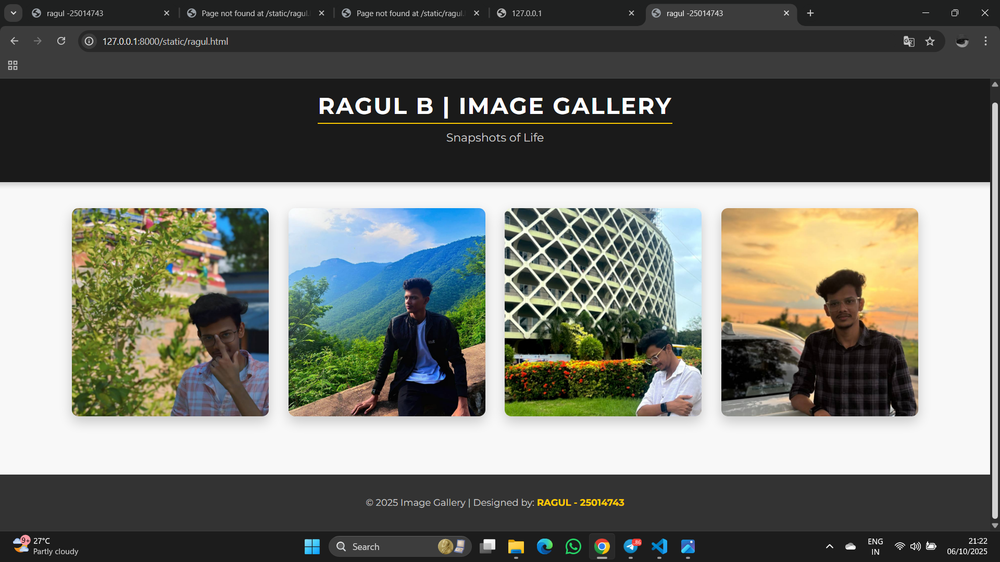

# Ex.08 Design of Interactive Image Gallery
## Date:06/10/2025

## AIM:
To design a web application for an inteactive image gallery with minimum five images.

## DESIGN STEPS:

### Step 1:
Clone the github repository and create Django admin interface.

### Step 2:
Change settings.py file to allow request from all hosts.

### Step 3:
Use CSS for positioning and styling.

### Step 4:
Write JavaScript program for implementing interactivity.

### Step 5:
Validate the HTML and CSS code.

### Step 6:
Publish the website in the given URL.

## PROGRAM :
```
ragul.html
<html lang="en">
<head>
    <meta charset="UTF-8">
    <meta name="viewport" content="width=device-width, initial-scale=1.0">
    <title>ragul -25014743</title>
    <link href="https://fonts.googleapis.com/css2?family=Montserrat:wght@400;700&display=swap" rel="stylesheet">
    <link rel="stylesheet" href="ragul.css">
</head>
<body>
    <header>
        <div class="header-content">
            <h1>RAGUL B | IMAGE GALLERY</h1>
            <p class="subtitle">Snapshots of Life</p>
        </div>
    </header>

    <main class="gallery-container">
        
        <div class="image-grid">
            <div class="gallery-item">
                
            </div>
            <div class="gallery-item">
                
            </div>
            <div class="gallery-item">
                
            </div>
            <div class="gallery-item">
                
            </div>
        </div>

        <div id="modal" class="modal">
            <span class="close" id="close">&times;</span>
            
            <div id="caption" class="modal-caption"></div>
        </div>
        
    </main>

    <footer class="footer">
        <p>&copy; 2025 Image Gallery | Designed by: <span class="designer-name">RAGUL - 25014743</span></p>
    </footer>

    <script src="ragul.js"></script>
</body>
</html>
ragul.css
body {
    font-family: 'Montserrat', sans-serif; 
    margin: 0;
    padding: 0;
    background-color: #f8f8f8; 
    display: flex;
    flex-direction: column; 
    align-items: center;
    min-height: 100vh; 
    overflow-x: hidden;
}
header {
    background-color: #1a1a1a; 
    color: #fff;
    padding: 40px 20px;
    width: 100%;
    box-shadow: 0 4px 8px rgba(0, 0, 0, 0.2);
    text-align: center;
}

header h1 {
    font-size: 2.2em;
    margin: 0;
    letter-spacing: 2px;
    border-bottom: 2px solid #ffcc00; 
    display: inline-block;
    padding-bottom: 5px;
}

.subtitle {
    font-size: 1.1em;
    color: #ccc;
    margin-top: 10px;
    font-weight: 400;
}


.gallery-container {
    padding: 40px 20px;
    max-width: 1300px;
    width: 100%;
    margin-bottom: 50px; 
}

.image-grid {
    display: grid;
    grid-template-columns: repeat(auto-fill, minmax(300px, 1fr)); 
    gap: 30px; 
}

.gallery-item img {
    width: 100%;
    height: 320px; 
    object-fit: cover; 
    border-radius: 10px;
    box-shadow: 0 8px 20px rgba(0, 0, 0, 0.2);
    transition: transform 0.3s ease, box-shadow 0.3s ease;
    cursor: pointer;
}

.gallery-item img:hover {
    transform: scale(1.03); 
    box-shadow: 0 12px 30px rgba(255, 0, 0, 0.5); 
}


.modal {
    display: none; 
    position: fixed;
    z-index: 1000; 
    left: 0;
    top: 0;
    width: 100%;
    height: 100%;
    display: flex;
    flex-direction: column; 
    justify-content: center;
    align-items: center;
    background-color: rgba(0, 0, 0, 0.95); 
    padding: 0;
}

.modal-content {
    display: block;
    max-width: 95vw;
    max-height: 85vh; 
    width: auto;
    height: auto;
    object-fit: contain; 
    border-radius: 5px;
    animation: zoom 0.4s;
}

.modal-caption {
    color: #ffcc00; 
    font-size: 1.3em;
    padding: 15px 0 0 0;
    font-weight: 700;
}

.close {
    position: absolute;
    top: 25px;
    right: 45px;
    color: #ffffff;
    font-size: 50px;
    font-weight: 200;
    transition: 0.3s;
    cursor: pointer;
    z-index: 1001; 
}

.close:hover {
    color: #e50000;
    transform: rotate(90deg); 
}

@keyframes zoom {
    from {transform: scale(0.7)}
    to {transform: scale(1)}
}


.footer {
    background-color: #333;
    color: #ccc;
    padding: 20px 0;
    width: 100%;
    margin-top: auto; 
    text-align: center;
    font-size: 0.9em;
}

.designer-name {
    color: #ffcc00; 
    font-weight: 700;
}

ragul.js
document.addEventListener('DOMContentLoaded', () => {
    const images = document.querySelectorAll('.gallery-item img');
    const modal = document.getElementById('modal');
    const modalImg = document.getElementById('modal-img');
    const closeBtn = document.getElementById('close');
    const captionText = document.getElementById('caption'); 

    images.forEach((image) => {
        image.addEventListener('click', () => {
            modal.style.display = 'flex'; 
            modalImg.src = image.src;
            captionText.innerHTML = image.getAttribute('data-caption') || image.alt;
        });
    });
    closeBtn.addEventListener('click', () => {
        modal.style.display = 'none';
    });
    modal.addEventListener('click', (event) => {
        if (event.target === modal) {
            modal.style.display = 'none';
        }
    });
});

```
## OUTPUT:


## RESULT:
The program for designing an interactive image gallery using HTML, CSS and JavaScript is executed successfully.
